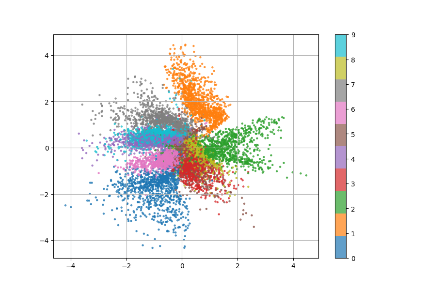

# Python AutoEncoder from scratch using Numpy
<center>
    <figure>
    
    <figcaption>
        Latent-space representation of the MNIST dataset using Variational Autoencoder
    </figcaption>
    </figure>
</center>

## Usage 

1. To install from source :
```sh
$ git clone git@github.com:lenoctambule/autoencoder.git
$ pip install -e autoencoder/
```

Or install from PyPI :
```sh
$ pip install easyvae
```

2. Optionally, run mnist_test.py to see it in action on the MNIST dataset.
```sh
$ cd examples
$ py mnist_test.py 
```

## Training

Instatiate an `ClassicalAutoencoder` or `VariationalAutoencoder` object :
```py
from easyvae.autoencoder import ClassicalAutoencoder, VariationalAutoencoder
from easyvae.activations import LeakyReLU

autoencoder = ClassicalAutoencoder(
    [768, 64, 16],
    [16, 64, 768],
    0.01,
    LeakyReLU()
)
# or
autoencoder = VariationalAutoencoder(
    [768, 64, 16],
    [16, 64, 768],
    0.01,
    LeakyReLU()
)
```
And then via the `train_dataset` method to train over a dataset :
```py
autoencoder.train_dataset(data)
```
Or via the `train` method to input each data points iteratively :
```py
autoencoder.train(v)
```

After training, you can save your model via the `save` method and load that model using `load` method :
```
autoencoder.save("mymodel.npy)
autoencoder.load("mymodel.npy")
```

## Inference

Use your `Autoencoder` object with the `encode`, `decode`, `forward` methods like so :
```py
example = ...
code = autoencoder.encode(example)
output = autoencoder.decode(code)
output, code = autoencoder.forward(example)
```
